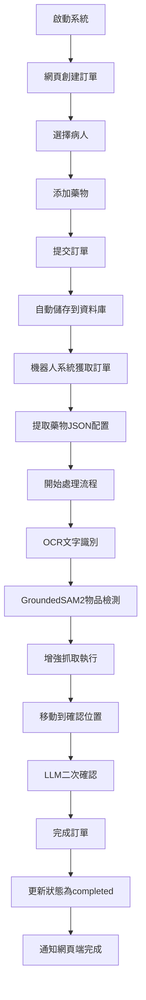
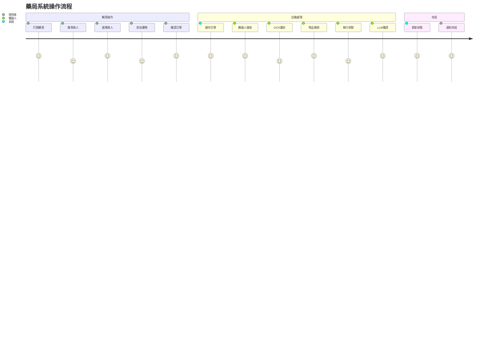
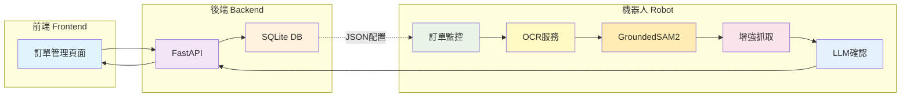
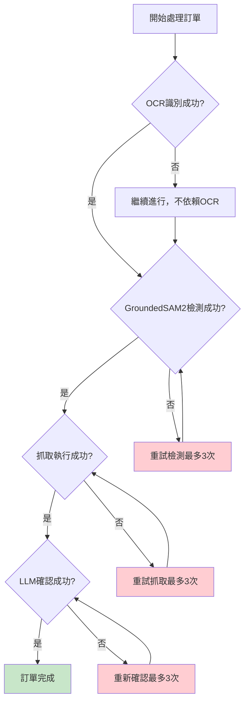
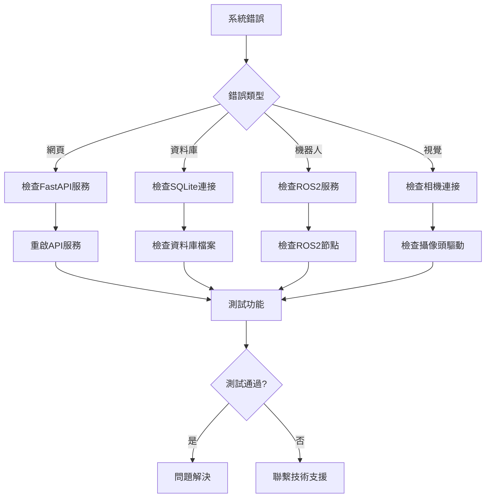

# 藥局系統執行流程圖

## 🚀 簡化執行流程



## 📱 用戶操作步驟



## 🔧 核心技術整合流程



## 📊 數據流轉示意圖

```mermaid
sankey-beta
  web界面,資料庫,100
  資料庫,機器人系統,100
  機器人系統,OCR服務,25
  機器人系統,GroundedSAM2,50
  機器人系統,增強抓取,75
  機器人系統,LLM確認,25
  OCR服務,整合結果,25
  GroundedSAM2,整合結果,50
  增強抓取,整合結果,75
  LLM確認,整合結果,25
  整合結果,訂單完成,175
  訂單完成,web界面,175
```

## 🎯 關鍵決策點



## 🏃‍♂️ 快速啟動指令

```bash
# 1. 啟動完整系統
ros2 launch graspnet simple_pharmacy_system.launch.py

# 2. 單獨啟動組件
ros2 run tm_robot_main integrated_robot_system

# 3. 啟動網頁界面
cd tm_robot/src/user_interface
python main.py

# 4. 訪問網頁
http://localhost:8000
```

## 📋 系統狀態監控

```mermaid
gitgraph
    commit id: "系統啟動"
    commit id: "資料庫初始化"
    commit id: "服務連接"
    branch order-processing
    commit id: "接收訂單"
    commit id: "OCR識別"
    commit id: "SAM2檢測"
    commit id: "執行抓取"
    commit id: "LLM確認"
    checkout main
    merge order-processing
    commit id: "訂單完成"
    commit id: "狀態更新"
```

## 🔍 故障診斷流程

