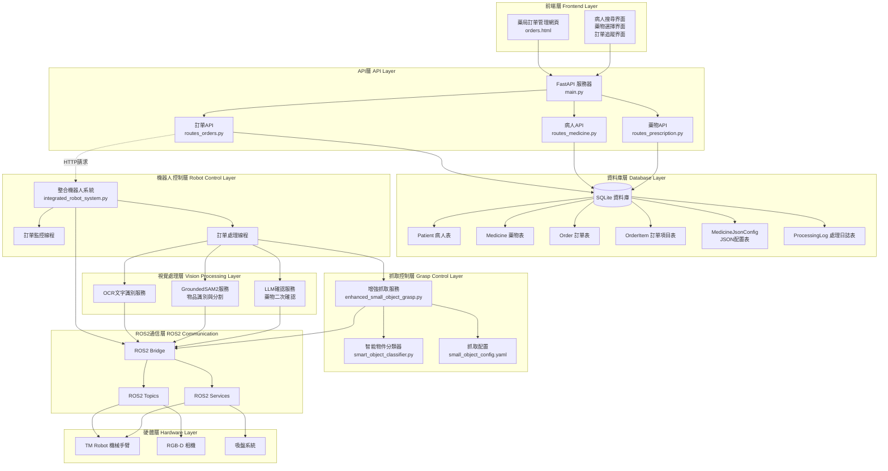
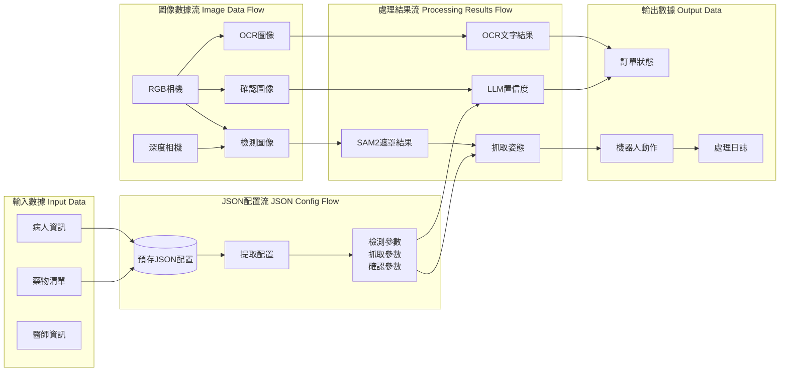
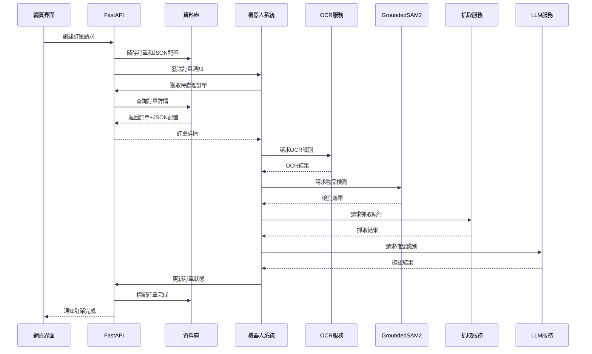

# 藥局自動化系統 - 架構圖與流程圖

## 🏗️ 整體系統架構圖



## 📋 完整業務流程圖

```mermaid
flowchart TD
    START([系統啟動]) --> INIT[初始化資料庫<br/>載入JSON配置]
    
    subgraph "網頁端操作 Web Operations"
        SEARCH_PATIENT[搜尋病人<br/>輸入姓名/病歷號]
        SELECT_PATIENT[選擇病人]
        ADD_MEDICINE[添加藥物<br/>選擇藥物種類和數量]
        CREATE_ORDER[創建訂單]
    end
    
    subgraph "資料庫操作 Database Operations"
        SAVE_ORDER[儲存訂單到資料庫]
        LINK_JSON[關聯藥物JSON配置]
        SET_PENDING[設置訂單狀態為pending]
    end
    
    subgraph "機器人系統 Robot System"
        FETCH_ORDER[機器人獲取待處理訂單]
        EXTRACT_JSON[提取藥物JSON配置]
        START_PROCESS[開始處理訂單]
    end
    
    subgraph "OCR階段 OCR Stage"
        CAPTURE_OCR[拍攝圖像進行OCR]
        OCR_ANALYSIS[OCR文字識別分析]
        OCR_RESULT[獲得OCR結果<br/>輔助後續識別]
    end
    
    subgraph "GroundedSAM2階段 GroundedSAM2 Stage"
        CAPTURE_VISION[拍攝RGB-D圖像]
        GROUNDED_DETECT[GroundedSAM2物品檢測]
        GENERATE_MASK[生成物品遮罩]
        VALIDATE_DETECTION{檢測成功?}
    end
    
    subgraph "抓取階段 Grasp Stage"
        ANALYZE_OBJECT[分析物件特性]
        PLAN_GRASP[規劃抓取策略]
        EXECUTE_GRASP[執行抓取動作]
        MOVE_TO_CONFIRM[移動到確認位置]
        GRASP_SUCCESS{抓取成功?}
    end
    
    subgraph "LLM確認階段 LLM Confirmation Stage"
        CAPTURE_CONFIRM[在確認位置拍攝]
        LLM_VERIFY[LLM藥物識別確認]
        COMBINE_RESULTS[結合OCR和視覺結果]
        LLM_SUCCESS{確認成功?}
    end
    
    subgraph "完成階段 Completion Stage"
        DISPENSE[完成藥物分發]
        UPDATE_STATUS[更新訂單狀態為completed]
        LOG_PROCESS[記錄處理日誌]
        NOTIFY_COMPLETE[通知前端訂單完成]
    end
    
    INIT --> SEARCH_PATIENT
    SEARCH_PATIENT --> SELECT_PATIENT
    SELECT_PATIENT --> ADD_MEDICINE
    ADD_MEDICINE --> CREATE_ORDER
    CREATE_ORDER --> SAVE_ORDER
    SAVE_ORDER --> LINK_JSON
    LINK_JSON --> SET_PENDING
    SET_PENDING --> FETCH_ORDER
    
    FETCH_ORDER --> EXTRACT_JSON
    EXTRACT_JSON --> START_PROCESS
    START_PROCESS --> CAPTURE_OCR
    
    CAPTURE_OCR --> OCR_ANALYSIS
    OCR_ANALYSIS --> OCR_RESULT
    OCR_RESULT --> CAPTURE_VISION
    
    CAPTURE_VISION --> GROUNDED_DETECT
    GROUNDED_DETECT --> GENERATE_MASK
    GENERATE_MASK --> VALIDATE_DETECTION
    
    VALIDATE_DETECTION -->|成功| ANALYZE_OBJECT
    VALIDATE_DETECTION -->|失敗| RETRY_DETECT[重試檢測]
    RETRY_DETECT --> CAPTURE_VISION
    
    ANALYZE_OBJECT --> PLAN_GRASP
    PLAN_GRASP --> EXECUTE_GRASP
    EXECUTE_GRASP --> GRASP_SUCCESS
    
    GRASP_SUCCESS -->|成功| MOVE_TO_CONFIRM
    GRASP_SUCCESS -->|失敗| RETRY_GRASP[重試抓取]
    RETRY_GRASP --> PLAN_GRASP
    
    MOVE_TO_CONFIRM --> CAPTURE_CONFIRM
    CAPTURE_CONFIRM --> LLM_VERIFY
    LLM_VERIFY --> COMBINE_RESULTS
    COMBINE_RESULTS --> LLM_SUCCESS
    
    LLM_SUCCESS -->|確認成功| DISPENSE
    LLM_SUCCESS -->|確認失敗| RETRY_LLM[重新確認]
    RETRY_LLM --> CAPTURE_CONFIRM
    
    DISPENSE --> UPDATE_STATUS
    UPDATE_STATUS --> LOG_PROCESS
    LOG_PROCESS --> NOTIFY_COMPLETE
    NOTIFY_COMPLETE --> END([處理完成])
```



## 🔄 數據流向圖



## 🎯 核心組件通信圖



## 📁 文件組織架構

```
tm_robot/
├── src/
│   ├── user_interface/           # 網頁界面層
│   │   ├── main.py              # FastAPI主應用
│   │   ├── route/
│   │   │   ├── routes_orders.py # 訂單API路由
│   │   │   ├── routes_medicine.py
│   │   │   └── routes_prescription.py
│   │   ├── database/
│   │   │   ├── pharmacy_models.py    # 資料庫模型
│   │   │   ├── pharmacy_db.py        # 資料庫服務
│   │   │   ├── medicine_db.py
│   │   │   └── prescription_db.py
│   │   └── static/html/
│   │       └── orders.html       # 訂單管理頁面
│   │
│   ├── tm_robot_main/           # 機器人控制層
│   │   └── tm_robot_main/
│   │       ├── integrated_robot_system.py  # 整合機器人系統
│   │       ├── simple_pharmacy_system.py   # 簡化系統
│   │       └── main_control.py             # 主控制節點
│   │
│   └── graspnet/                # 抓取控制層
│       ├── graspnet/
│       │   ├── enhanced_small_object_grasp.py  # 增強抓取
│       │   ├── smart_object_classifier.py      # 智能分類器
│       │   └── small_object_config.yaml        # 抓取配置
│       └── launch/
│           ├── simple_pharmacy_system.launch.py
│           └── complete_pharmacy_system.launch.py
│
└── extra_package/               # 額外服務
    └── llm_drug_identification_system/
        └── main.py              # LLM藥物識別
```

## 🔧 技術棧說明

### 前端技術
- **HTML/CSS/JavaScript**: 網頁界面
- **FastAPI**: 後端API框架
- **Jinja2**: 模板引擎

### 資料庫技術
- **SQLite**: 輕量級資料庫
- **SQLModel**: ORM框架
- **JSON**: 配置存儲格式

### 機器人技術
- **ROS2**: 機器人作業系統
- **OpenCV**: 圖像處理
- **Open3D**: 3D點雲處理

### 人工智能技術
- **GroundedSAM2**: 物品檢測與分割
- **OCR**: 文字識別
- **LLM**: 大語言模型確認
- **機器學習**: 物件分類和抓取策略

這個架構圖清楚展示了從網頁訂單管理到機器人執行的完整流程，以及各個組件之間的詳細交互關係。